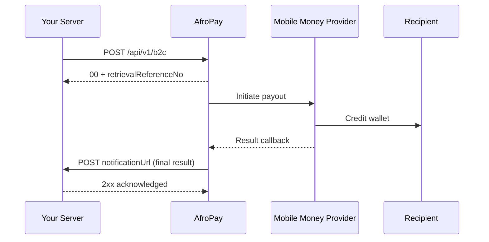

A B2C (Business-to-Customer) payout disburses funds from your AfroPay account to a recipient's mobile money wallet — for refunds, withdrawals, supplier settlements, and payroll. Like collections, payouts are asynchronous: the initial API call only acknowledges the request, and AfroPay delivers the final outcome to your `notificationUrl` once the mobile money provider confirms the result. This guide explains the request format and asynchronous outcome model.

## Flow



The synchronous response is an **acknowledgement** only — it confirms AfroPay accepted and queued the payout. The funds are disbursed asynchronously and the outcome is delivered to your `notificationUrl`.

## Initiate a payout

Send a `POST` request with a bearer token to the production endpoint below. All fields are in the request body as JSON.

**Production endpoint:** `POST https://payment-gateway.descartes.solutions/api/v1/b2c`

<CodeGroup>

```bash cURL
curl -X POST https://payment-gateway.descartes.solutions/api/v1/b2c \
  -H "Authorization: Bearer $ACCESS_TOKEN" \
  -H "Content-Type: application/json" \
  -d '{
    "transactionId": "PAYOUT-2026-0042",
    "amount": 5000.00,
    "currency": "KES",
    "recipientMsisdn": "254712345678",
    "recipientName": "Jane Wanjiru",
    "paymentMethodCode": "M-PESA",
    "countryCode": "KEN",
    "narration": "Supplier settlement",
    "notificationUrl": "https://merchant.example.com/webhooks/afropay"
  }'
```

</CodeGroup>

On acceptance, AfroPay returns a `00` status with a `retrievalReferenceNo` you should store for correlation:

```json
{
  "status": "00",
  "message": "Payout request received",
  "data": {
    "retrievalReferenceNo": "RRN-3B1E88A402",
    "merchantReferenceId": "PAYOUT-2026-0042"
  }
}
```

## Request fields

<ParamField body="transactionId" type="string" required>
  Your unique reference for this payout. It is echoed back as `merchantReferenceId` in the response and in any subsequent webhook. Use it for idempotency and reconciliation.
</ParamField>

<ParamField body="amount" type="number" required>
  Amount to disburse, in the major unit of the currency. For example, `5000.00` represents KES 5,000.
</ParamField>

<ParamField body="currency" type="string" required>
  ISO 4217 currency code, e.g. `KES`.
</ParamField>

<ParamField body="recipientMsisdn" type="string" required>
  The recipient's mobile number in international format without a leading `+`, e.g. `254712345678`.
</ParamField>

<ParamField body="recipientName" type="string">
  The recipient's display name. Used for record-keeping and shown on the provider's confirmation screen where supported.
</ParamField>

<ParamField body="paymentMethodCode" type="string" required>
  The mobile money network to disburse through. Resolved together with `countryCode` to identify the correct provider.

  | `paymentMethodCode` | `countryCode` | Network |
  | --- | --- | --- |
  | `M-PESA` | `KEN` | Safaricom M-PESA |
  | `AIRTEL` | `KEN` | Airtel Money Kenya |
</ParamField>

<ParamField body="bankCode" type="string">
  Supply this field when paying out to a bank account instead of a mobile wallet. Omit for wallet payouts.
</ParamField>

<ParamField body="countryCode" type="string" required>
  ISO 3166-1 alpha-3 country code, e.g. `KEN`.
</ParamField>

<ParamField body="narration" type="string">
  Free-text description of the payout. Visible to the recipient where supported by the provider.
</ParamField>

<ParamField body="notificationUrl" type="string">
  Webhook URL that AfroPay calls with the final payout result. Strongly recommended — without it you must poll for the outcome manually.
</ParamField>

## Response

<ResponseField name="status" type="string">
  `00` = accepted, `01` = rejected. This reflects whether AfroPay accepted the request, **not** whether funds reached the recipient.
</ResponseField>

<ResponseField name="message" type="string">
  Human-readable detail about the response. On acceptance: `"Payout request received"`.
</ResponseField>

<ResponseField name="data.retrievalReferenceNo" type="string">
  AfroPay's internal reference for this payout. Store it — you will use it to correlate the incoming webhook and to poll for status via `GET /api/v1/transaction/{referenceId}`.
</ResponseField>

<ResponseField name="data.merchantReferenceId" type="string">
  Your `transactionId`, echoed back verbatim for confirmation.
</ResponseField>

<Warning>
  A `status` of `00` means the payout was **accepted for processing, not delivered**. Confirm funds have reached the recipient only after a webhook or status poll reports `transactionStatus: SUCCESS`. Mark the payout complete only at that point.
</Warning>

## C2B vs. B2C comparison

Use this table to quickly distinguish the two flows:

| | C2B Collection | B2C Payout |
| --- | --- | --- |
| **Endpoint** | `POST /api/v1/c2b` | `POST /api/v1/b2c` |
| **Direction** | Customer → Your account | Your account → Recipient |
| **Counterparty field** | `msisdn` | `recipientMsisdn` |
| **Customer action required** | Yes — approves STK/USSD prompt | No |
| **Bank payout support** | — | Yes, via `bankCode` |

## Next steps

<CardGroup cols={2}>
  <Card title="C2B Collections" icon="arrow-down-to-line" href="/guides/c2b-collections">
    Learn how to pull funds from a customer's mobile wallet into your account.
  </Card>
  <Card title="Webhooks" icon="webhook" href="/guides/webhooks">
    Learn the webhook payload format, how to respond, and how retries work.
  </Card>
</CardGroup>
