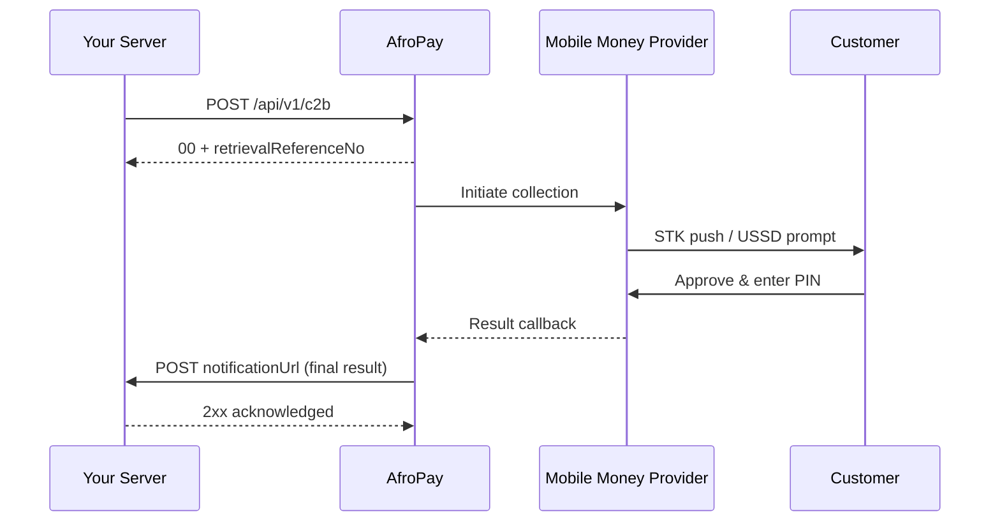

A C2B (Customer-to-Business) collection triggers an STK push or USSD prompt so the customer can authorize a debit from their mobile wallet. Once the customer approves the request on their handset, AfroPay receives a callback from the mobile money provider and delivers the final outcome to your `notificationUrl`. This guide covers the full request/response flow and field reference.

## Flow



The synchronous response is an **acknowledgement** only — it confirms that AfroPay accepted the request and queued it for processing. The money has not moved yet. The final outcome arrives asynchronously at your `notificationUrl`.

## Initiate a collection

Send a `POST` request with a bearer token to the production endpoint below. All fields are in the request body as JSON.

**Production endpoint:** `POST https://payment-gateway.descartes.solutions/api/v1/c2b`

<CodeGroup>

```bash cURL
curl -X POST https://payment-gateway.descartes.solutions/api/v1/c2b \
  -H "Authorization: Bearer $ACCESS_TOKEN" \
  -H "Content-Type: application/json" \
  -d '{
    "transactionId": "ORD-2026-0001",
    "amount": 1500.00,
    "currency": "KES",
    "msisdn": "254712345678",
    "paymentMethodCode": "M-PESA",
    "countryCode": "KEN",
    "narration": "Payment for order ORD-2026-0001",
    "notificationUrl": "https://merchant.example.com/webhooks/afropay"
  }'
```

</CodeGroup>

On acceptance, AfroPay returns a `00` status with a `retrievalReferenceNo` you should store for correlation:

```json
{
  "status": "00",
  "message": "Payment request received",
  "data": {
    "retrievalReferenceNo": "RRN-7F3A9C2B10",
    "merchantReferenceId": "ORD-2026-0001"
  }
}
```

## Request fields

<ParamField body="transactionId" type="string" required>
  Your unique reference for this transaction. It is echoed back as `merchantReferenceId` in the response and in any subsequent webhook. Use it for idempotency and reconciliation on your side.
</ParamField>

<ParamField body="amount" type="number" required>
  Amount to collect, in the major unit of the currency. For example, `1500.00` represents KES 1,500.
</ParamField>

<ParamField body="currency" type="string" required>
  ISO 4217 currency code, e.g. `KES`.
</ParamField>

<ParamField body="msisdn" type="string" required>
  The customer's mobile number in international format without a leading `+`, e.g. `254712345678`.
</ParamField>

<ParamField body="paymentMethodCode" type="string" required>
  The mobile money network to collect through. Resolved together with `countryCode` to identify the correct provider.

  | `paymentMethodCode` | `countryCode` | Network |
  | --- | --- | --- |
  | `M-PESA` | `KEN` | Safaricom M-PESA |
  | `AIRTEL` | `KEN` | Airtel Money Kenya |
</ParamField>

<ParamField body="countryCode" type="string" required>
  ISO 3166-1 alpha-3 country code, e.g. `KEN`.
</ParamField>

<ParamField body="narration" type="string">
  Free-text description of the payment. Displayed to the customer during the STK/USSD prompt where supported by the provider.
</ParamField>

<ParamField body="notificationUrl" type="string">
  Webhook URL that AfroPay calls with the final transaction result. Strongly recommended — without it you must poll for the outcome manually.
</ParamField>

## Response

<ResponseField name="status" type="string">
  `00` = accepted, `01` = rejected. This reflects whether AfroPay accepted the request, **not** whether the payment succeeded.
</ResponseField>

<ResponseField name="message" type="string">
  Human-readable detail about the response. On acceptance: `"Payment request received"`.
</ResponseField>

<ResponseField name="data.retrievalReferenceNo" type="string">
  AfroPay's internal reference for this transaction. Store it — you will use it to correlate the incoming webhook and to poll for status via `GET /api/v1/transaction/{referenceId}`.
</ResponseField>

<ResponseField name="data.merchantReferenceId" type="string">
  Your `transactionId`, echoed back verbatim for confirmation.
</ResponseField>

<Warning>
  A `status` of `00` means **accepted, not paid**. Treat the payment as complete only after a webhook or status poll reports `transactionStatus: SUCCESS`. Fulfilling an order on acceptance alone risks shipping goods for a payment that never completes.
</Warning>

## Handling rejection

If AfroPay cannot accept the request — due to a validation failure, unsupported payment method, or a backend error — `status` is `01` and `data` is `null`:

```json
{
  "status": "01",
  "message": "Payment request failed: invalid msisdn format",
  "data": null
}
```

A `01` at this stage means the request never entered processing. It is safe to correct the offending field and retry using the same `transactionId`.

## Next steps

<CardGroup cols={2}>
  <Card title="Transaction Lifecycle" icon="arrows-rotate" href="/guides/transaction-lifecycle">
    Understand each state a collection moves through — INITIATED, PENDING, SUCCESS, FAILED, and INDETERMINATE.
  </Card>
  <Card title="Webhooks" icon="webhook" href="/guides/webhooks">
    Learn the webhook payload format, how to respond, and how retries work.
  </Card>
</CardGroup>
