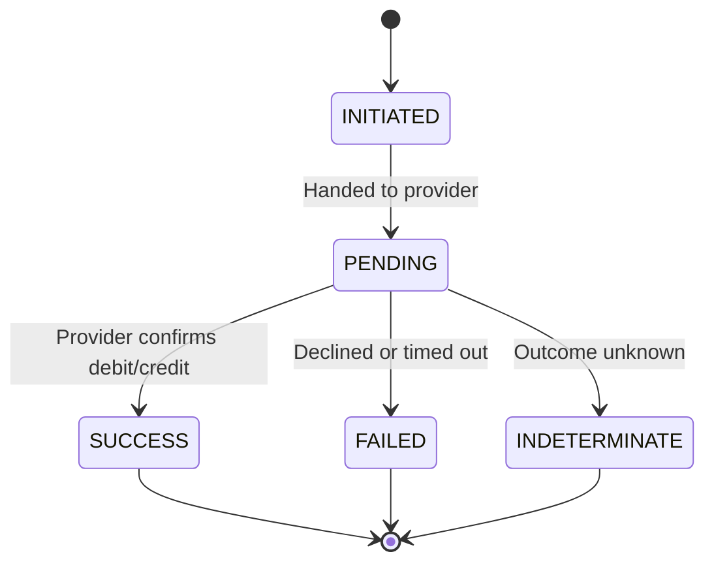

Every C2B and B2C transaction moves through a lifecycle of states from the moment AfroPay accepts the request to the moment it reaches a terminal outcome. Because both flows are asynchronous, the `flag` field — not the initial HTTP response — is the authoritative signal for whether funds moved. This page explains each state, clarifies the difference between the top-level `status` code and the lifecycle `flag`, and shows you how to poll when a webhook has not arrived.

## Transaction states

| Flag | Type | Meaning |
| --- | --- | --- |
| `INITIATED` | Non-terminal | The request was accepted by AfroPay and is queued, but has not yet been handed to the mobile money provider. |
| `PENDING` | Non-terminal | In flight — the customer has been prompted (C2B) or the payout is being processed (B2C). AfroPay is awaiting the provider's confirmation. |
| `SUCCESS` | Terminal | Funds moved successfully. For C2B, the customer was debited; for B2C, the recipient was credited. |
| `FAILED` | Terminal | The transaction was declined or errored — insufficient funds, customer rejection, timeout, invalid recipient, etc. Inspect `failureReason` and `failureMessage` for detail. |
| `INDETERMINATE` | Needs reconciliation | The provider's outcome could not be determined. Do not assume success or failure — reconcile before taking any action. |

## Status code vs. flag

There are two distinct signals in the AfroPay API. Do not conflate them:

| Signal | Location | Meaning |
| --- | --- | --- |
| `status` | Top-level field of every response and webhook | `"00"` = the API call was accepted / the transaction succeeded; `"01"` = rejected or failed |
| `flag` / `transactionStatus` | Inside `data` in the transaction record and webhook body | The lifecycle state of the transaction: `INITIATED`, `PENDING`, `SUCCESS`, `FAILED`, or `INDETERMINATE` |

In a webhook, the top-level `status` is derived from the lifecycle flag: `"00"` when `transactionStatus` is `SUCCESS`, and `"01"` otherwise. The `flag` is always the authoritative answer to whether money moved.

## State diagram



Prefer [webhooks](/guides/webhooks) for real-time results. Use status polling as a backstop when a webhook has not arrived.

## Polling for status

If you have not received a webhook — for example, because your endpoint was temporarily down — you can query the transaction directly using the `retrievalReferenceNo` returned in the initial acceptance response. No authentication token is required for this endpoint.

**Endpoint:** `GET https://payment-gateway.descartes.solutions/api/v1/transaction/{referenceId}`

<CodeGroup>

```bash cURL
curl https://payment-gateway.descartes.solutions/api/v1/transaction/RRN-7F3A9C2B10
```

</CodeGroup>

```json
{
  "status": "00",
  "message": "Success",
  "data": {
    "flag": "SUCCESS",
    "amount": 1500.00,
    "currencyCode": "KES",
    "merchantReferenceId": "ORD-2026-0001",
    "retrievalReferenceNo": "RRN-7F3A9C2B10",
    "providerCode": "SASAPAY",
    "billingMobileNumber": "254712345678"
  }
}
```

<Note>
  This endpoint is public — no bearer token is required — but it only returns data for references that belong to your account. Read `data.flag` for the lifecycle state. The top-level `status: "00"` here indicates that the lookup itself succeeded, not necessarily that the transaction did.
</Note>

## Recommended handling

Follow these steps to handle transaction outcomes safely and idempotently:

<Steps>
  <Step title="Keep orders open while non-terminal">
    While `flag` is `INITIATED` or `PENDING`, the transaction is still in progress. Do not fulfil, cancel, or retry — simply wait for a webhook or poll again after a reasonable interval.
  </Step>
  <Step title="Act on terminal states exactly once">
    On `SUCCESS`, fulfil the order or confirm the payout. On `FAILED`, release any held funds and cancel the order. Make both actions idempotent by keying them on your `transactionId` so that duplicate webhooks or poll responses are no-ops.
  </Step>
  <Step title="Quarantine INDETERMINATE — never auto-retry">
    An `INDETERMINATE` outcome means the provider's result could not be determined. Never automatically retry — doing so risks double-charging a customer or double-paying a recipient. Reconcile the transaction with your records (or contact AfroPay support) before taking any further action.
  </Step>
</Steps>

## Next steps

<CardGroup cols={2}>
  <Card title="Webhooks" icon="webhook" href="/guides/webhooks">
    Learn the webhook payload format, how to respond, and retry behavior.
  </Card>
  <Card title="C2B Collections" icon="arrow-down-to-line" href="/guides/c2b-collections">
    Review the full collection request/response flow.
  </Card>
</CardGroup>
